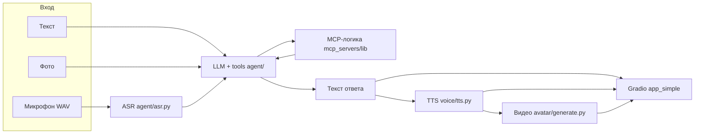

# AI Avatar Agent

Мультимодальный ассистент-гид по ресторанам **Алматы**: принимает **текст, изображение и голос**, отвечает текстом, при необходимости озвучивает ответ **клонированным голосом** и строит **видео с говорящим аватаром**. Доступ к данным — через **MCP-инструменты** (2GIS, Chocolife, ABR) и **function calling** в одном процессе с Gradio.

### Интерфейс в браузере: что к чему

| Что открываете | Что это |
|----------------|---------|
| **`python app_simple.py`** → `http://127.0.0.1:7860` | **Веб:** полный пайплайн (ASR, LLM, TTS, видео ген). Интерфейс строит **Gradio** из **`app_simple.py`**; логика обработчиков — **`gradio_handlers.py`**. Отдельной папки фронта **нет**. |
| **`index.html`** в браузере | **Статическая** страница без бэкенда, демо без реального ASR/LLM. **Не** интерфейс Gradio. |


---

Ниже — что попадает в ZIP скриптом и что нет.

| В архив | Описание |
|--------|----------|
| Весь **исходный код** проекта | `app_simple.py`, `gradio_handlers.py`, `config.py`, `index.html`, `agent/` (в т.ч. `asr.py`, `speech_text.py`), `mcp_servers/` (включая `lib/`), `voice/clone.py`, `voice/tts.py`, `voice/my_voice_sample.wav`, `avatar/*.py`, `requirements.txt`, `.env.example`, `.gitignore` |
| **`avatar/my_photo.jpg`** | Копия из первого найденного: `photo_*.jpg` в корне, `avatar_512.jpg` или `avatar/my_photo.jpg` |
| Доп. файлы из корня | `github_repo.txt` и пр. мелочи, если есть (кроме исключений ниже) |

| Не в архив | Причина |
|-----------|--------|
| **`venv/`**, **`.venv/`** | Окружение |
| **`.env`** | Секреты; только **`.env.example`** |
| **`voice/.minimax_voice_id`** | Привязка голоса к аккаунту |
| **`__pycache__/`**, **`.pytest_cache/`**, **`node_modules/`** | Кэш и мусор |
| **`*.bin`**, **`*.pt`**, **`*.ckpt`** | Тяжёлые веса моделей |
| **`project05.pdf`** | Большой файл методички |
| **`avatar/pipeline_avatar.mp4`** | Черновик; в ZIP попадает копия как **`assets/demo.mp4`**, не дублируем гигабайты |
| **`video_demo_pitch.mp4`** | Питч и пр. внешние ролики — **не в архив** |
| **`scripts/`** | `package_submission.ps1` — только для автора, не в сдаче |

**Имя архива для автора:** `Saltanat_Tugayeva.zip`, внутри папка **`Saltanat_Tugayeva/`**.

---

## Соответствие техническому заданию

| Требование | Реализация |
|----------------------|------------|
| Вход: текст, изображение, аудио | Gradio: вкладки голос (WAV) и текст+фото; `agent/pipeline.py` — multimodal user message. |
| Выход: текст + видео аватара | Ответ в чате; TTS → при включении — **Creatify Aurora** (`avatar/generate.py`). |
| **Минимум 2 из 3 MCP**: 2GIS, Chocolife | `mcp_servers/twogis/`, `mcp_servers/chocolife/` + те же tools в `agent/tools.py`. |
| Бонус: ABR Group | `mcp_servers/abr_group/`, tool `search_abr_restaurants`. |
| MCP — отдельный процесс (stdio/SSE) | `mcp_servers/*/server.py` (FastMCP, stdio); инструкция запуска ниже. |
| LLM + **function calling** (не хардкод) | `agent/llm.py` — цикл `tool_calls` → `execute_tool`. |
| **Память** диалога | `agent/memory.py`, сессия в Gradio. |
| **Vision** по фото блюда/интерьера | Вложение в запрос + опционально tool `analyze_restaurant_photo`. |
| **Custom skill** «ресторанный критик» | `agent/restaurant_vision.py`, схема (`level`, `status`, `description`, `confidence`). |
| **ASR** | `agent/asr.py`: локальный Whisper (**HF**) или **OpenAI** `whisper-1`. |
| **Voice clone + TTS** (MiniMax / fal) | `voice/clone.py`, `voice/tts.py` (`fal-ai/minimax/voice-clone`, `speech-02-*`). |
| **Аватар** (фото ≥512×512, Aurora) | `avatar/image_utils.py` (512×512), `fal-ai/creatify/aurora`. |
| **Gradio** | UI из **`app_simple.py`**, обработчики в **`gradio_handlers.py`**; отдельного фронтенд-проекта нет — виджеты Gradio в Python. |

**Отличие от формулировки «только Playwright» в методичке:** парсинг 2GIS реализован через **httpx + BeautifulSoup** (и опционально Playwright при `TWO_GIS_USE_PLAYWRIGHT=1`). Chocolife — скрейп каталога в `mcp_servers/lib/`. Смысл ТЗ (реальные данные, отдельные MCP-процессы, tools с теми же именами/ролями) сохранён.

---

## Критерии оценки — где смотреть

| Баллы | Критерий | В проекте |
|------:|----------|-----------|
| 25 | MCP (≥2), агент вызывает tools | `mcp_servers/`, `agent/tools.py`, `demo_tools.py` |
| 20 | LLM + tool calling + memory | `agent/llm.py`, `agent/memory.py`, `agent/pipeline.py` |
| 10 | Vision (фото в ответе) | Вкладка текст+фото, `chat_turn` с изображением |
| 5 | Custom skill критик | `analyze_restaurant_photo` → `restaurant_vision.py` |
| 10 | Voice clone + TTS | `voice/clone.py`, `voice/tts.py`, `voice/.minimax_voice_id` |
| 20 | Видео аватара, lip sync | `avatar/generate.py`, Creatify Aurora |
| 10 | README + видео-демо 2–3 мин | Этот файл + **`assets/demo.mp4`** |

---

##README 

- [x] **Описание проекта** (2–3 предложения) — в начале файла.  
- [x] **Архитектура** — схема pipeline (Mermaid) и блок «Архитектура и реализация».  
- [x] **Какие модели** — таблица «Модели и сервисы».  
- [x] **Запуск по шагам:** зависимости → `.env` → MCP → приложение — раздел «Инструкция запуска».  
- [ ] **Скриншоты / GIF** — добавьте файлы и перечислите в разделе ниже.  
- [ ] **Стоимость API** — заполните приблизительные суммы OpenAI / fal.  
- [x] **Что улучшили бы** — раздел «Что улучшили бы при большем времени».

---

## Архитектура: pipeline



Конфигурация: **`config.py`**, секреты — **`.env`** (шаблон: **`.env.example`**).

---

## Модели и сервисы (что выбрано и зачем)

| Компонент | Выбор | Зачем |
|-----------|--------|--------|
| LLM | `OPENAI_MODEL` (по умолчанию **gpt-4o-mini**) | Tool calling, достаточная дешевизна/скорость по ТЗ. |
| ASR (локально) | **Whisper** в `transformers`, `ASR_MODEL_ID` (по умолчанию `openai/whisper-small`) | Соответствие ТЗ «локальный Whisper»; казахский — `ASR_LOCAL_LANGUAGE`, опционально `abilmansplus/whisper-turbo-ksc2`. |
| ASR (облако) | OpenAI **whisper-1** | Без тяжёлых весов на диске; `ASR_BACKEND=openai`. |
| Клон + TTS | **fal.ai** MiniMax (`voice-clone`, `speech-02-turbo` / HD) | Как в методичке. |
| Видео аватара | **Creatify Aurora** `fal-ai/creatify/aurora` | Как в методичке; 720p, длина по аудио. |
| Критик по фото | Vision через OpenAI API | JSON-ответ, поля уровень / статус / описание / confidence. |

---

## Инструкция запуска (пошагово)

### 1. Зависимости

- Python **3.12+**, виртуальное окружение по желанию.
- В корне проекта:

```bash
pip install -r requirements.txt
```

При `TWO_GIS_USE_PLAYWRIGHT=1`: `pip install playwright` и `playwright install chromium`.

### 2. Настройка `.env`

Скопируйте шаблон в `.env` (в PowerShell: `Copy-Item .env.example .env`; в Linux/macOS: `cp .env.example .env`).

Заполните минимум **`OPENAI_API_KEY`** и **`FAL_KEY`** ([fal.ai](https://fal.ai)). Остальное — см. **`.env.example`** и раздел [Переменные окружения](#переменные-окружения).

### 3. Аудиосэмпл голоса (ТЗ: ≥10 с)

Файл по умолчанию: **`voice/my_voice_sample.wav`**. Другое имя — `VOICE_SAMPLE_FILENAME` в `.env`.

### 4. Клон голоса (один раз, платно на стороне fal)

```bash
python voice/clone.py
```

Идентификатор сохраняется в **`voice/.minimax_voice_id`** (в архив для сдачи не класть).

### 5. Запуск MCP отдельно (для Cursor / другого MCP-клиента)

Отдельный процесс на сервер, как в модуле 5:

```bash
python mcp_servers/twogis/server.py
python mcp_servers/chocolife/server.py
python mcp_servers/abr_group/server.py
```

В настройках клиента: команда `python`, аргумент — полный путь к `server.py`, рабочая папка — **корень проекта**. Подхват **`.env`**: `mcp_servers/bootstrap.py`.

**Gradio** (`app_simple.py`) MCP не поднимает: tools вызываются **напрямую** тем же кодом, что и в `mcp_servers/lib/`.

Проверка без Cursor:

```bash
python mcp_servers/demo_tools.py
```

### 6. Запуск приложения (Gradio)

```bash
python app_simple.py
```

Откроется `http://127.0.0.1:7860`.

### 7. Видео-аватар — **в последнюю очередь**

По методичке: сначала отладите MCP, LLM, ASR, TTS; **Creatify Aurora** тратит баланс fal — включайте генерацию видео, когда остальное стабильно. Держите ответы агента **короче (ориентир 15–30 с речи)** — длина видео следует за аудио.

### Проверка TTS из консоли

```bash
python voice/tts.py "Бүгін кешке Алматыда екі адамға мейрамхана ұсынамын."
```

---

## Инструменты ассистента (function calling)

| Tool | Назначение |
|------|------------|
| `search_restaurants` | 2GIS: API при наличии ключа или парсинг **2gis.kz** без ключа. |
| `search_deals` | Chocolife, категория «Еда», Алматы. |
| `search_abr_restaurants` | Сеть ABR / ABR Group в Алматы. |
| `analyze_restaurant_photo` | Custom skill: уровень, статус, описание, `confidence` по фото. |

**Примеры запросов:** «Итальянская кухня в Алматы на двоих», «Скидки на стейки в Chocolife», «Где ABR рядом».

**2GIS:** `TWO_GIS_API_KEY` необязателен; для обхода как в ТЗ через браузер — `TWO_GIS_USE_PLAYWRIGHT=1`.

---

## ASR (казахская / русская речь)

- **Локально:** `ASR_BACKEND=local`, `ASR_LOCAL_LANGUAGE`: `kazakh` / `russian` / `auto` и др., модель — `ASR_MODEL_ID`.
- **OpenAI:** `ASR_BACKEND=openai`, задайте `ASR_OPENAI_LANGUAGE` (`kk`, `ru` или пусто — авто может путать языки). После смены — перезапуск приложения.

---

## Переменные окружения

Полный список плейсхолдеров и значений по умолчанию — в **`.env.example`**. Ключевые: `OPENAI_API_KEY`, `FAL_KEY`, `OPENAI_MODEL`, `MINIMAX_TTS_MODEL`, `MINIMAX_LANGUAGE_BOOST`, `ASR_BACKEND`, `ASR_MODEL_ID`, `ASR_LOCAL_LANGUAGE`, `ASR_OPENAI_LANGUAGE`, пути аватара и сэмпла голоса.

---

## Рекомендуемый порядок отладки (из методички)

1. MCP / данные: `demo_tools.py` или отдельные серверы — есть ли ответы 2GIS / Chocolife / ABR.  
2. LLM + tools: осмысленные ответы с вызовом инструментов, без хардкода финального текста.  
3. ASR: корректная транскрипция.  
4. Клон и TTS: озвучка клоном.  
5. Видео Creatify — только после стабилизации шагов 1–4.

**Не хардкодить ответы** — данные должны идти из tools. **Голос и фото** — свои (или с согласия), как в ТЗ.

---

## Скриншоты, демо, питч, бюджет (по ТЗ)

- **Скриншоты / GIF** интерфейса Gradio (in `assets/screens/ and assets/screens2/`) и кратко перечислите имена файлов здесь:  
  - *(заполните при сдаче)*  
 Питч-ролик **`video_demo_pitch.mp4`** в архив **не кладётся**.  
- **Стоимость API** 20$ for fal.ai api only  open ai api less than 1$

---

## Что улучшили бы при большем времени

- **ASR под казахский:** дообучала бы или использовала специализированные корпуса и модели — в том числе **Mangisoz** (ISSAI), **SpeechKit** (Yandex), линейку **NeMo** (NVIDIA) для экспериментов с качеством и латентностью.  
- **Тяжёлый локальный Whisper:** запускала бы распознавание на **мощной машине с GPU** с моделью **[abilmansplus/whisper-turbo-ksc2](https://huggingface.co/abilmansplus/whisper-turbo-ksc2)** (Whisper large-v3-turbo, дообучен на казахском KSC2, ~9% WER на тесте по карточке модели) — вместо компактного `whisper-small` на CPU.  
- Дополнительно имело бы смысл **кэширование** ответов парсеров 2GIS/Chocolife и **routing** моделей (дешёвая модель для простых реплик).

---

## Статический `index.html`

Это **не** интерфейс Gradio. Отдельный HTML/CSS/JS: страница **без бэкенда**, микрофон и текст — **демо-сценарий** с продолжением реплик в **sessionStorage** (кнопка **«Жаңа диалог»**). Ни ASR, ни LLM. Рабочий проект по ТЗ — **`app_simple.py`** (Gradio).

---

## Структура проекта

```
Saltanat_Tugayeva/   
├── README.md
├── requirements.txt
├── .env.example
├── config.py
├── app_simple.py          # Gradio UI (запуск для ТЗ)
├── gradio_handlers.py     # обработчики вкладок (чат, голос, TTS, фото)
├── index.html             # статический демо-UI, не Gradio
├── agent/
│   ├── llm.py
│   ├── tools.py
│   ├── pipeline.py
│   ├── memory.py
│   ├── restaurant_vision.py
│   ├── asr.py               # ASR (Whisper локально / OpenAI)
│   └── speech_text.py       # текст под TTS (без URL)
├── mcp_servers/
│   ├── twogis/              # server.py + README.md
│   ├── chocolife/
│   └── abr_group/
├── voice/
│   ├── clone.py             # клон голоса
│   ├── tts.py               # TTS
│   └── my_voice_sample.wav  # сэмпл ≥10 с (в ZIP в voice/ только эти три файла)
├── avatar/
│   ├── generate.py
│   ├── image_utils.py
│   └── my_photo.jpg         # по ТЗ (скрипт копирует в архив)
├── assets/
│   └── demo.mp4             # демо 2–3 мин (ТЗ)
```

Плюс каталог **`mcp_servers/lib/`** с логикой 2GIS / Chocolife / ABR (нужен для `server.py` и агента).

**Не включать в ZIP:** `venv/`, `.env`, `voice/.minimax_voice_id`, `__pycache__/`, **`scripts/`**, тяжёлые веса (`.bin`, `.pt`, `.ckpt`), `node_modules/`, черновики больших MP4 в `avatar/` (в архиве достаточно `assets/demo.mp4`).

---

## Архитектура и реализация (детали)

### Поток данных

**Вход** (WAV / текст / изображение) → **ASR** (только голос) → **LLM + tools + память** → при необходимости **2GIS / Chocolife / ABR / analyze_restaurant_photo** → **текст** → опционально **TTS** (MiniMax через fal) и **видео** (Creatify Aurora) → **Gradio**.

### ASR (`agent/asr.py`)

- `ASR_BACKEND=openai` — API OpenAI, модель `whisper-1`, язык `ASR_OPENAI_LANGUAGE`.  
- Иначе — локальный Whisper (HF): чанки, singleton модели, `ASR_LOCAL_LANGUAGE` / forced decoder ids.

### LLM и память

- `agent/llm.py` — цикл Chat Completions с `tools`.  
- `agent/tools.py` — `TOOL_DEFINITIONS`, `SYSTEM_PROMPT`, `execute_tool` + `tool_context` (например `image_data_url` для фото текущего хода).  
- `agent/pipeline.py` + `agent/memory.py` — `chat_turn`, усечённая текстовая история, multimodal user message.

### Custom skill

- `agent/restaurant_vision.py` — `analyze_restaurant_photo`: vision-модель, JSON с полями уровня, статуса, описания, уверенности.

### Озвучка и видео

- `agent/speech_text.py` — `sanitize_for_speech` перед TTS.  
- `voice/tts.py`, `voice/clone.py` — fal MiniMax.  
- `avatar/image_utils.py` — подготовка **512×512**; `avatar/generate.py` — Aurora.

### MCP и Gradio

MCP-серверы — отдельные процессы для внешних клиентов; Gradio вызывает **те же функции** из `mcp_servers/lib` внутри одного процесса Python.

---

## Типичные ошибки fal

### `403` на `rest.fal.ai/storage/auth/token`

Проверьте **`FAL_KEY`** в [Dashboard → API Keys](https://fal.ai/dashboard): без пробелов, без префикса `Bearer`. `voice/clone.py` может пробовать загрузку WAV как data URL — при отказе уменьшите сэмпл (mono, 16 kHz, 10–20 с).

### `User is locked` / `Exhausted balance`

Пополните баланс: [fal.ai/dashboard/billing](https://fal.ai/dashboard/billing). Без баланса клон и MiniMax TTS не работают.

---


Из корня проекта:

```powershell
powershell -ExecutionPolicy Bypass -File .\scripts\package_submission.ps1 -StudentFolderName "Saltanat_Tugayeva"
```

В **`dist_submission\`** появятся **`Saltanat_Tugayeva\`** и **`Saltanat_Tugayeva.zip`**.

Скрипт дополнительно:

- исключает **`venv`**, **`.env`**, **`__pycache__`**, **`.git`**, **`scripts/`**, **`voice/.minimax_voice_id`**, **`*.bin` / `*.pt` / `*.ckpt`**, **`project05.pdf`**, **`avatar/pipeline_avatar.mp4`**, любой **`video_demo_pitch.mp4`**, **`app.py`** (если файл случайно появится);
- в **`voice/`** кладёт **только** **`clone.py`**, **`tts.py`**, **`my_voice_sample.wav`** (ASR и подготовка текста к озвучке — в **`agent/`**);
- копирует **`avatar/my_photo.jpg`** из доступного исходника фото;
- копирует **`assets/demo.mp4`** (из `pipeline_avatar` или готового `assets/demo.mp4`).

### Ручная проверка перед отправкой

1. В архиве только **`.env.example`**, не **`.env`**.  
2. Есть **`assets/demo.mp4`** (демо 2–3 мин по ТЗ).  
3. В **`voice/`** — **`my_voice_sample.wav`** (≥10 с).  
4. Нет **`venv`**, **`node_modules`**, **`__pycache__`**.
